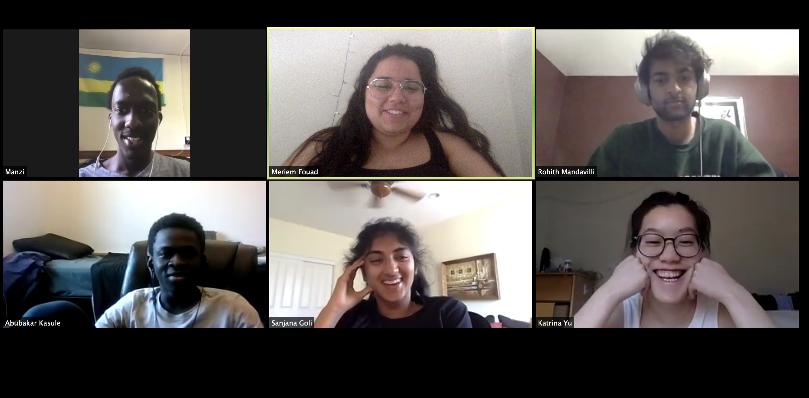

# Project Name: Iminsi

TODO: short project description, some sample screenshots or mockups

## Architecture

Backend: https://github.com/dartmouth-cs52-20S/project-api-iminsi

## Setup

`cd project-iminsi/iminsi`
Run `expo start` in terminal (need to have Xcode simulator downloaded)

## Deployment

In order to deploy, first run `expo start`
Click the option to publish the project (on the left side of the screen).
Enter your expo credentials

## Authors

Meriem Fouad, Sanjana Goli, Abubakar Kasule, Rohith Mandavilli, Bryan Manzi, Katrina Yu

## Acknowledgments
